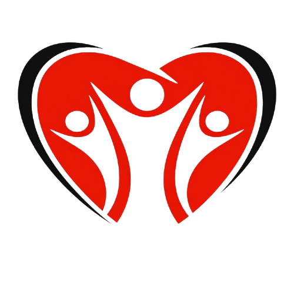

# BSRV Medical & Dental Office Website

A modern, responsive website for BSRV Medical & Dental Office - a walk-in clinic in Toronto, Canada.



## 🏥 About

BSRV Medical & Dental Office is a family medical clinic located in Scarborough, Toronto. We provide comprehensive healthcare services with a focus on patient satisfaction and excellent clinical outcomes.

**Location:** 3430 Finch Ave E, Suite 6A, Scarborough, ON M1W 2R5  
**Phone:** 416-649-6388  
**Email:** bsrvmedical@gmail.com

## ✨ Features

- 🏠 **Responsive Design** - Works perfectly on all devices (mobile, tablet, desktop)
- 🌙 **Dark Mode** - Built-in theme switcher for comfortable viewing
- 📅 **Online Appointments** - Automated appointment request system via EmailJS
- 📍 **Google Maps Integration** - Interactive clinic location map
- 💬 **Multilingual Support** - Staff available in English, Tamil, Hindi, Urdu, and more
- ⚡ **Fast Performance** - Built with Vite for optimal loading speeds
- ♿ **Accessible** - WCAG compliant with proper ARIA labels
- 📧 **Email Notifications** - Automatic email alerts for appointment requests

## 🛠️ Tech Stack

- **Frontend Framework:** React 18.3.1
- **Routing:** React Router DOM 7.13.2
- **Styling:** Tailwind CSS 3.4.17
- **Animations:** Framer Motion 11.15.0
- **Icons:** Lucide React 0.468.0
- **Build Tool:** Vite 6.0.3
- **Email Service:** EmailJS (@emailjs/browser)
- **Deployment:** Netlify

## 📋 Services

### General Medicine
- Family Medicine & Primary Care
- Chronic Disease Management
- Children & Adult Care
- Acute Care for Illnesses
- Preventive Health & Annual Physicals
- Vaccinations & Immunizations
- Women's Health
- Minor Procedures

### Nephrology (Kidney Health)
- Chronic Kidney Disease – Stages 1–5
- Hypertension Management
- Kidney Stones Prevention
- Electrolyte Disorders
- Dialysis Support

## 🚀 Getting Started

### Prerequisites

- Node.js (v20 or higher)
- npm or yarn

### Installation

1. **Clone the repository**
   ```bash
   git clone https://github.com/zainabqureshi09/Clinic-Website.git
   cd Clinic-Website
   ```

2. **Install dependencies**
   ```bash
   npm install
   ```

3. **Configure EmailJS** (for appointment form)
   
   Create/Edit `src/config/emailjs.js` with your EmailJS credentials:
   ```javascript
   export const EMAILJS_CONFIG = {
     publicKey: 'YOUR_PUBLIC_KEY',
     serviceId: 'YOUR_SERVICE_ID',
     templateId: 'YOUR_TEMPLATE_ID',
   };
   ```
   
   **Get your EmailJS credentials:**
   - Sign up at [EmailJS](https://www.emailjs.com/)
   - Create a Gmail service
   - Create an email template
   - Get your API keys from Account Settings

4. **Start development server**
   ```bash
   npm run dev
   ```

5. **Open in browser**
   - Navigate to `http://localhost:3000`

## 📦 Build & Deployment

### Production Build
```bash
npm run build
```

### Preview Production Build
```bash
npm run preview
```

### Deploy to Netlify

The site is automatically deployed to Netlify when you push to the `master` branch.

1. Connect your GitHub repository to [Netlify](https://netlify.com)
2. Netlify will automatically detect the Vite build settings
3. Configure environment variables if needed
4. Add your custom domain in Netlify dashboard

**Build Settings:**
- **Build Command:** `npm run build`
- **Publish Directory:** `dist`
- **Node Version:** 20

## 📁 Project Structure

```
Clinic-Website/
├── public/
│   ├── favicon.ico          # Favicon
│   ├── logo.png             # Clinic logo
│   ├── manifest.json        # PWA manifest
│   └── *.jpg                # Clinic images
├── src/
│   ├── components/          # Reusable React components
│   │   ├── Navbar.jsx
│   │   ├── Footer.jsx
│   │   ├── Hero.jsx
│   │   ├── Services.jsx
│   │   └── ...
│   ├── pages/               # Page components
│   │   ├── Home.jsx
│   │   ├── Services.jsx
│   │   ├── Appointment.jsx
│   │   └── ...
│   ├── config/              # Configuration files
│   │   └── emailjs.js       # EmailJS configuration
│   ├── context/             # React Context (Theme, etc.)
│   ├── layouts/             # Layout components
│   ├── App.jsx              # Main App component
│   ├── main.jsx             # Entry point
│   └── index.css            # Global styles
├── netlify.toml             # Netlify configuration
├── package.json             # Dependencies
├── tailwind.config.js       # Tailwind configuration
├── vite.config.js           # Vite configuration
└── README.md                # This file
```

## 🔧 Configuration Files

### `netlify.toml`
```toml
[build]
  command = "npm run build"
  publish = "dist"

[build.environment]
  NODE_VERSION = "20"

[[redirects]]
  from = "/*"
  to = "/index.html"
  status = 200
```

### `vite.config.js`
Configured with code splitting for optimal performance:
- React vendor bundle
- Framer Motion bundle
- Lucide Icons bundle

## 📱 Pages

- **Home** - Hero section, stats, quick services preview
- **Our Doctors** - Doctor profiles and information
- **Specialists** - Nephrology specialty information
- **Services** - Detailed service descriptions
- **Appointment** - Online appointment request form
- **Contact** - Contact information and Google Maps location

## 🎨 Design Features

- **Responsive Navbar** - Adapts to all screen sizes with mobile menu
- **Circular Image Gallery** - Animated floating images on homepage
- **Gradient Text** - Custom gradient animations
- **Smooth Scrolling** - Scroll to top on page navigation
- **Custom Scrollbar** - Branded scrollbar styling
- **Loading States** - Smooth transitions and loading indicators

## 🔒 Security

- HTTPS enforced via Netlify
- No sensitive data in client-side code
- EmailJS handles email delivery securely
- Form validation on client-side

## 📧 Email Template Variables

For EmailJS template setup, use these variables:
- `{{patient_name}}` - Patient's full name
- `{{patient_email}}` - Patient's email address
- `{{patient_phone}}` - Patient's phone number
- `{{department}}` - Selected department
- `{{doctor}}` - Preferred doctor
- `{{preferred_date}}` - Requested appointment date
- `{{preferred_time}}` - Requested appointment time
- `{{message}}` - Additional notes
- `{{to_email}}` - Clinic email (bsrvmedical@gmail.com)

## 🤝 Contributing

This is a private repository for BSRV Medical & Dental Office. For questions or issues, please contact the development team.

## 📄 License

Private - All rights reserved to BSRV Medical & Dental Office

## 📞 Support

For technical support or questions about the website:
- **Email:** bsrvmedical@gmail.com
- **Phone:** 416-649-6388

## 🙏 Acknowledgments

- Icons by [Lucide](https://lucide.dev/)
- UI Components with [Tailwind CSS](https://tailwindcss.com/)
- Animations by [Framer Motion](https://www.framer.com/motion/)
- Email service by [EmailJS](https://www.emailjs.com/)

---

**Made with ❤️ for patients**

© 2024 BSRV Medical & Dental Office. All rights reserved.
